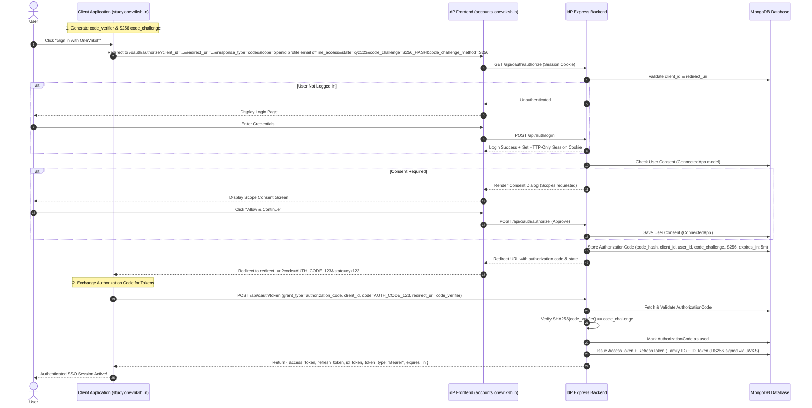
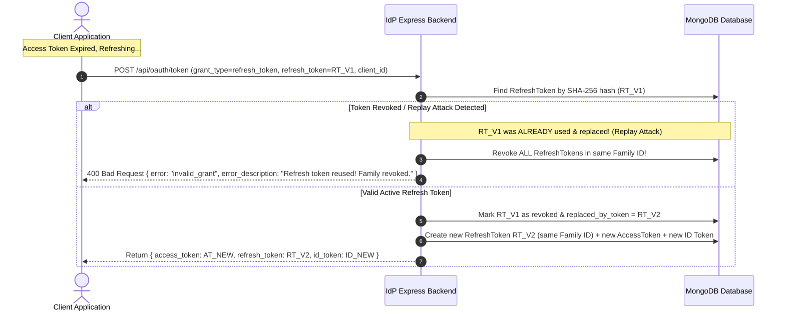
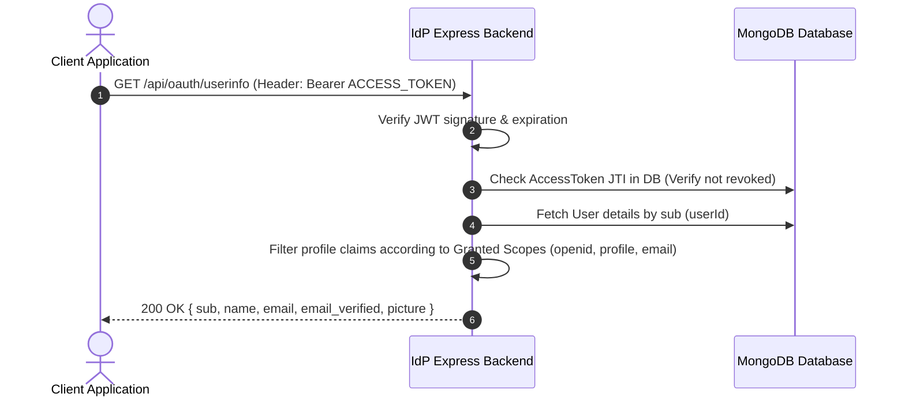
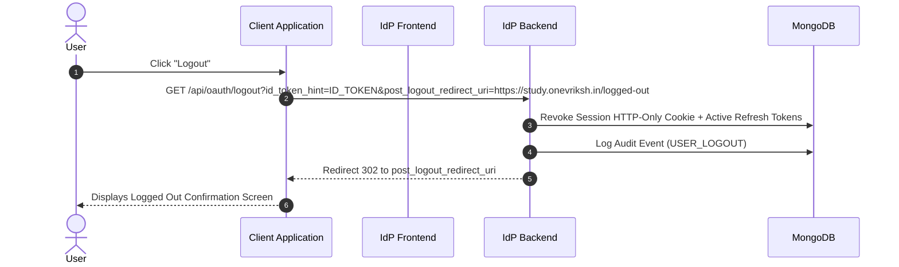

# OneVriksh Accounts - Enterprise Sequence Diagrams

This document contains visual sequence diagrams illustrating the end-to-end authentication, authorization, token lifecycle, and session management workflows.

---

## 1. OAuth 2.1 Authorization Code Flow with PKCE & Consent

---

## 2. Refresh Token Rotation & Replay Attack Detection

---

## 3. OIDC UserInfo & Claims Retrieval

---

## 4. Single Logout & RP-Initiated Logout

